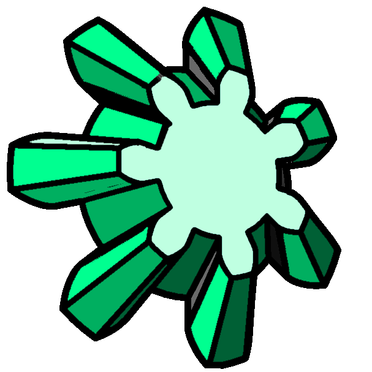

# JT Bevel Gears

 

---

JT Bevel Gears Pro lets you generate accurate bevel gear solids inside Autodesk® Fusion® without leaving your design environment. Set your parameters, position the gear on any point or face, and click Generate.

**Key features**
- Full parametric control: number of teeth (z), external module (m), pitch cone angle (δ), pressure angle (α), face width (b)
- Real-time SVG preview — isometric + top + side views update live as you type
- Two positioning modes: base-center (place the gear on its back face) or apex (position from the cone vertex with a reference plane)
- Involute tooth profile with automatic chord-accuracy control (or manual override)
- Automatic rotation axes generated after each gear
- Custom gear naming from the UI
- Feature grouping in the Fusion timeline for a clean, editable history
- Generates a native Fusion solid body, ready for further modeling, assemblies and simulation

**Bevel Gear Mate (Pro exclusive)**
Generate a mating bevel gear (R2) directly from an existing R1 gear. The mate command reads R1's geometry and places R2 in the correct meshing position automatically.

**Typical workflow**
1. Open the Create panel in the Solid workspace
2. Click JT Bevel Gears
3. Configure parameters in the palette — preview updates live
4. Select the placement point (and optionally a reference plane)
5. Click Generate
6. Use Bevel Gear Mate to add the mating gear in one step

---

📖 [Full Help & Documentation](https://jtplugin.github.io/fusion-bevel-gears/help)

---

## Versions

| Feature | Pro | LT | Trial |
|---------|---|---|---|
| Auto rotation axes | ✅ | ✅ | ❌ |
| Auto rotation references | ✅ | ❌ | ❌ |
| Apex positioning mode | ✅ | ✅ | Base center only |
| Custom gear naming | ✅ | ✅ | Fixed default name |
| Timeline feature grouping | ✅ | ✅ | Not grouped |
| Gear generations per session | Unlimited | Unlimited | 3 |
| Cone angle (δ) | Full range | Full range | 45° only |
| Tooth count (z) | Full range | Full range | z ∈ {12, 18, 24} |

---

[Privacy Policy](https://jtplugin.github.io/privacy-policy) · [Terms of Service](https://jtplugin.github.io/terms) · [Support](mailto:jtplugin@ajl.vision)

---

*Plugin for Autodesk® Fusion® — developed by [JT Plugin Development](https://jtplugin.github.io)*
